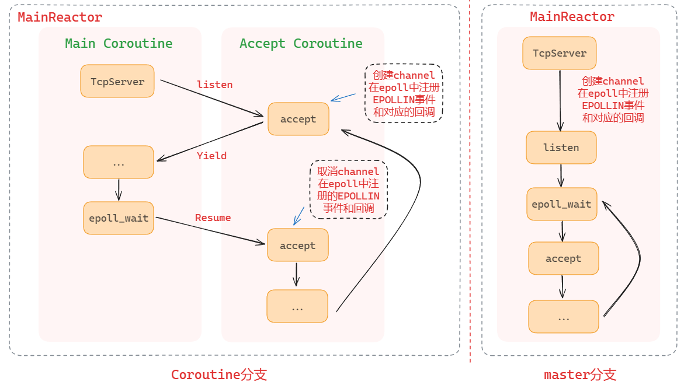

## [Shero](https://github.com/ning2510/shero)

该分支引入了腾讯的开源协程库 [libco](https://github.com/Tencent/libco)，其思想是通过同步的代码实现异步的性能。该分支最初是我在学习 `tinyrpc` 时看到的，随后将这一部分引入到了 `shero` 中。


### 1. 协程模块

> **`shero` 中的协程模块来源于 [tinyrpc](https://github.com/Gooddbird/tinyrpc)**

下图对比了两个分支的 **同步非阻塞IO** 模型




#### 1.1 目录结构

```shell
shero
└── coroutine
    ├── Coctx.h
    ├── coctx_swap.S			# 开源库 libco
    ├── Coroutine.{h,cc}		# 协程相关
    ├── CoroutinePool.{h,cc}	# 协程池
    ├── Hook.{h,cc}				# Hook 相关
    └── Memory.{h,cc}			# 内存池
```

协程模块的思想就是 **用同步的代码，实现异步的性能**


#### 1.2 Hook 封装

协程模块使用了 `Hook` ，通过 `Hook` 模块，可以使一些不具异步功能的 `API`，展现出异步的性能。`shero` 提供了一些基本函数的 `Hook`，例如 `read`、`write`、`socket`等，详见 `shero/coroutine/Hook.h`


#### 1.3  M:N 协程模型

`shero` 采用的是 `M:N` 协程模型，即 `m` 个线程共同调度 `n` 个协程，`m` 个线程共用一个协程池。

`shero` 协程中至关重要的是：

- **`t_mainCoroutine`：**代表的是主协程。**在唤醒 `A` 协程时，会将当前各寄存器的信息保存到主协程中，然后将寄存器指向 `A` 协程中的回调函数。设置完成后，程序便会执行 `A` 协程的回调。**

- **`t_curCoroutine`：**代表的是当前协程，可以看作一个 "标记位"

这两个变量是 `thread local` 的，即每个线程都会拥有一个，所以每个线程之间的协程切换是不冲突的

**当 `t_curCoroutine == t_mainCoroutine` 时**，说明主协程持有这个 "标记位"，其他线程例如 `accept coroutine` 被 `Resume`，即将当前寄存器的值存入到主协程中，然后将寄存器的设置为 `accept coroutine` 内部的回调函数。交换完成后就会执行 `accept coroutine` 内部设置好的回调函数（相当于唤醒 `accept coroutine`）。**这一步通过 `Resume` 操作完成。**

当 `accept coroutine` 完成后想要再切换到主协程，**可以通过 `Yield` 操作完成。**即将当前寄存器的值设置为之前保存在主协程中的值

**当 `t_curCoroutine != t_mainCoroutine` 时**，说明当前线程中已经协程在执行


### 2. 性能测试

**测试工具：**[wrk](https://github.com/wg/wrk)

**测试代码：**`test/test_http_server.cc`

**测试环境：**

- **硬件：**`Intel i5-13600K CPU`，14 核 20 线程；内存 32 GB

- **操作系统：**`Debian GNU/Linux trixie/sid`

- **编译器：**`g++ 13.2.0`

**编译方式：**

- `./build.sh release`

**测试命令：**

- `test_http_server [IO 线程数量]`
- `wrk -c 1000 -t 8 -d 30 --latency 'http://127.0.0.1:9999'`
  - `-c`：并发连接数

|        QPS         | 并发数 1000 | 并发数 3000 | 并发数 5000 | 并发数 10000 |
| :----------------: | :---------: | :---------: | :---------: | :----------: |
| **IO 线程数为 1**  |  108806.68  |  99613.24   |  97039.55   |   96177.95   |
| **IO 线程数为 4**  |  338169.85  |  291760.88  |  279611.18  |  272352.59   |
| **IO 线程数为 8**  |  467746.72  |  373793.07  |  364146.05  |  344496.09   |
| **IO 线程数为 16** |  486230.00  |  364888.68  |  350331.47  |  332043.48   |

> 性能没有 `master` 分支好


### 3. 安装 shero
见 `master` 分支


**后续待补充...**