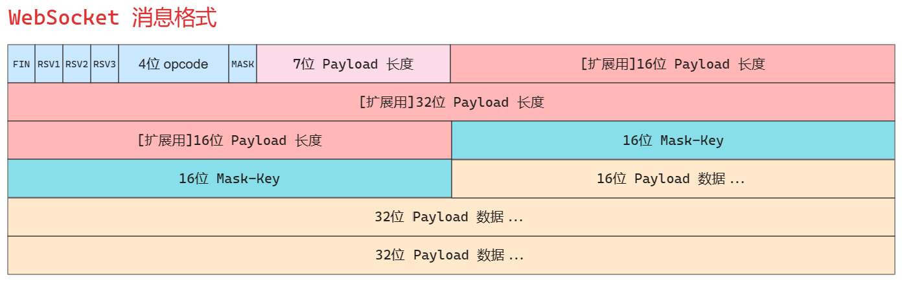

## [Shero](https://github.com/ning2510/shero)

`shero` 是一款基于 `C++11` 的网络库。在开发之初，我阅读了 [muduo](https://github.com/chenshuo/muduo)、[sylar](https://github.com/sylar-yin/sylar)、[tinyrpc](https://github.com/Gooddbird/tinyrpc) 三者的源码，之后将三者的优点进行合并后命名为 `shero`，旨在学习练手。

`shero` 除 `master` 分支外，还有一个分支 `coroutine`。该分支引入了腾讯的开源协程库 [libco](https://github.com/Tencent/libco)，其思想是通过同步的代码实现异步的性能。该分支最初是我在学习 `tinyrpc` 时看到的，随后将这一部分引入到了 `shero` 中。

`shero` 包括以下几个模块：

| 模块             | 源码                       | 备注                 |
| ---------------- | -------------------------- | -------------------- |
| 日志模块         | `shero/base/Log`           | 异步日志             |
| 配置模块         | `shero/base/Config`        | 支持 `xml` 和 `yaml` |
| 多线程模块       | `shero/base/Thread`        | -                    |
| 定时器模块       | `shero/base/Timer`         | -                    |
| 缓冲区模块       | `shero/net/Buffer`         | -                    |
| TCP 模块         | `shero/net/tcp/`           | -                    |
| HTTP 模块        | `shero/net/http/`          | 支持 `HTTP1.1`       |
| WebSocket 模块   | `shero/net/websocket/`     | -                    |
| I/O 多路复用模块 | `shero/net/EPollPoller`    | 采用 `Reactor` 模型  |
| 协程模块         | `shero/net/coroutine/`     | `coroutine` 分支     |
| Hook 模块        | `shero/net/coroutine/Hook` | `coroutine` 分支     |
| 测试模块         | `test/`                    | -                    |

`shero` 的线程模型是 `one loop per thread + thread poll` 模型。每个线程最多有一个 `EventLoop`。每个 `TcpConnection` 必须归某个 `EventLoop` 管理，所有的 `IO` 会转移到这个线程，换句话说就是一个文件描述符只能由一个线程读写。`TcpConnection` 所在的现在由其所属的 `EventLoop` 决定，这样我们可以很方便地把不同的 `TCP` 连接放到不同的线程去，也可以把一些 `TCP` 连接放到一个线程里。

`TcpServer` 支持多线程，它有两种模式：

- 单线程。`accept` 与 `TcpConnection` 用同一个线程做 `IO`
- 多线程。`accept` 与 `EventLoop` 在同一个线程，另外创建一个 `EventLoopThreadPool`，新到的连接会按 `round-robin` 方式分配到线程池中。


### 1. 目录结构

`shero` 的目录结构如下

```shell
shero
├── cmake
├── CMakeLists.txt
├── conf
├── README.md
├── shero				# shero 库的主体
│   ├── base			# 与网络无关的基础代码，位于 ::shero namespace
│   └── net				# 网络库
│       ├── http		# http 相关，位于 ::shero::http
│       │   └── client	# http client 相关，位于 ::shero::http::client
│       ├── tcp			# tcp 相关
│       └── websocket	# websocket 相关，位于 ::shero::ws
└── test				# 示例
```


#### 1.1 基础库

```shell
shero
└── base
    ├── Config.{h,cc}		# 配置模块
    ├── Endian.h			# 处理字节序
    ├── Log.{h,cc}			# 异步日志
    ├── Macro.h
    ├── Mutex.h				# 锁封装
    ├── Noncopyable.h
    ├── Singleton.h
    ├── Thread.{h,cc}		# 多线程
    ├── Timer.{h,cc}		# 定时器
    └── Util.{h,cc}
```


#### 1.2 网络核心库

```shell
shero
└── net
    ├── AbstractDispatch.h
    ├── AbstractServlet.h
    ├── Address.{h,cc}
    ├── Buffer.{h,cc}				# 缓冲区，非阻塞 IO 必备
    ├── Channel.{h,cc}				# 用于每个 Socket 连接的事件分发
    ├── EPollPoller.{h,cc}			# epoll
    ├── EventLoop.{h,cc}			# 事件分发器
    ├── EventLoopThread.{h,cc}		# 新建一个专门用于 EventLoop 的线程
    ├── EventLoopThreadPool.{h,cc}	# 默认多线程 IO 模型
    ├── http						# http 模块
    │   ├── client					# http 客户端
    │   │   ├── http11_common.h
    │   │   ├── HttpClient.{h,cc}
    │   │   ├── HttpClientParser.{h,cc}
    │   │   ├── httpclient_parser.h
    │   │   ├── httpclient_parser.rl
    │   │   └── httpclient_parser.rl.cc
    │   ├── HttpCommon.{h,cc}
    │   ├── HttpDispatch.{h,cc}		# http dispatch
    │   ├── HttpParser.{h,cc}		# 用于解析 http 请求
    │   ├── HttpServer.{h,cc}		# http 服务端
    │   ├── HttpServlet.{h,cc}		# http servlet
    │   ├── HttpStatus.{h,cc}		# http 状态定义
    ├── Poller.{h,cc}				# IO 多路复用基类接口
    ├── Socket.{h,cc}				# socket 封装
    ├── tcp							# tcp 模块
    │   ├── Callbacks.h
    │   ├── TcpAcceptor.{h,cc}		# 接收器，用于服务端接受连接
    │   ├── TcpClient.{h,cc}		# tcp 客户端
    │   ├── TcpConnection.{h,cc}	# 维护 tcp 连接
    │   ├── TcpConnector.{h,cc}		# 用于客服端连接服务端
    │   ├── TcpServer.{h,cc}		# tcp 服务端
    ├── Uri.h						# 解析 uri
    ├── Uri.rl
    ├── Uri.rl.cc
    └── websocket					# websocket 模块
        ├── WSClient.{h,cc}			# websocket 客户端
        ├── WSDispatch.{h,cc}
        ├── WSServer.{h,cc}			# websocket 服务端
        ├── WSServlet.{h,cc}
        └── WSStructure.{h,cc}		# websocket 报文解析
```


### 2. 性能测试

**测试工具：**[wrk](https://github.com/wg/wrk)

**测试代码：**`test/test_http_server.cc`

**测试环境：**

- **硬件：**`Intel i5-13600K CPU`，14 核 20 线程；内存 32 GB

- **操作系统：**`Debian GNU/Linux trixie/sid`

- **编译器：**`g++ 13.2.0`

**编译方式：**

- `./build.sh release`

**测试命令：**

- `test_http_server [IO 线程数量]`
- `wrk -c 1000 -t 8 -d 30 --latency 'http://127.0.0.1:9999'`
  - `-c`：并发连接数

|        QPS         | 并发数 1000 | 并发数 3000 | 并发数 5000 | 并发数 10000 |
| :----------------: | :---------: | :---------: | :---------: | :----------: |
| **IO 线程数为 1**  |  174858.83  |  149631.53  |  148169.39  |  145207.32   |
| **IO 线程数为 4**  |  627907.44  |  540136.62  |  523050.98  |  497675.53   |
| **IO 线程数为 8**  |  821609.79  |  760505.13  |  676127.65  |  645794.07   |
| **IO 线程数为 16** | 1181460.26  | 1055770.57  |  942536.85  |  789732.72   |


### 3. 安装 shero
#### 3.1 安装 yaml-cpp
```shell
$ git clone https://github.com/jbeder/yaml-cpp.git
$ cd yaml-cpp
$ mkdir build && cd build
$ cmake .. && make -j8
$ sudo cp libyaml-cpp.a /usr/local/lib/
$ cd ../include
$ sudo cp -r yaml-cpp /usr/local/include
```


#### 3.2 安装 tinyxml

> [下载地址](http://www.grinninglizard.com/tinyxml/)

修改 `Makefile`
```diff
# 84 行
- OUTPUT := xmltest
+ OUTPUT := libtinyxml.a

# 105 行
- ${LD} -o $@ ${LDFLAGS} ${OBJS} ${LIBS} ${EXTRA_LIBS}
+ ${AR} $@ ${LDFLAGS} ${OBJS} ${LIBS} ${EXTRA_LIBS}
```

编译
```shell
$ make -j8
$ sudo cp libtinyxml.a /usr/local/lib/
$ sudo mkdir /usr/local/include/tinyxml
$ sudo cp *.h /usr/local/include/tinyxml
```


#### 3.3 安装 ragel

```shell
sudo apt install ragel
```


#### 3.4 编译 shero

```shell
# 普通模式
$ ./build.sh

# 性能测试
$ ./build.sh release
```


#### 3.5 安装 shero

```shell
$ sudo cp -r include/ /usr/local/include
$ sudo cp -r lib/libshero.a /usr/local/lib
```


#### 3.6 引入 shero 到您的项目

> **须安装 `shero`**

在自己的项目中使用 `shero` 的例子在 `test/use_shero` 中

`shero` 的依赖库：

- `pthread`
- `openssl`
- `yaml-cpp`
- `tinyxml`

按照 `test/use_shero/CMakeLists.txt` 编写您项目的 `CMake` 即可


### 4. 总体设计

> `shero` 中 `epoll` 采用 `Level Trigger` 模式

`shero` 把 "主动调用 `recv` 来接收数据，主动调用 `accept` 来接受新连接，主动调用 `send` 来发送数据" 的思路换成 **"注册一个收数据的回调，网络库收到数据会调用我，直接把数据提供给我，供我消费。注册一个接受连接的回调，网络库接受了新连接会回调我，直接把新的连接对象传给我，供我使用。需要发送数据的时候，只管往连接中写，网络库会负责无阻塞地发送。"**


#### 4.1 网络架构


`shero` 采用的是 **多 `Reactor` 多线程** 的 `Reactor` 模型。每个线程都有一个 `EventLoop`，主线程是 `	MainReactor`，子线程是 `SubReactor`

- 主线程负责通过 `epoll` 监控连接建立事件，收到事件后通过 `Acceptor` 获取连接，采用 `round-robin` 的方式选择 `SubReactor`，并将新连接分配给该 `SubReactor`

- `SubReactor` 会将新连接加入到 `epoll` 中继续进行监听
- 如果 `SubReactor` 中有新的事件发生，会调用用户设置好的回调


#### 4.2 优雅关闭连接

`TcpConnection` 通过 `shutdown` 关闭了 “写” 方向的连接，保留了 “读” 方向。

使用 `shutdown` 而不用 `close` 效果是，如果对方已经发送了数据，这些数据还 “在路上”，那么 `shero` 不会漏收这些数据。间接解决了”当你打算关闭网络连接时，如何得知对方有没有发一些数据而你还没有收到？“这一问题。

这种关闭方式对对方也有要求，那就是对方 `read()` 到 0 字节之后会主动关闭连接。


#### 4.3 应用层 Buffer 缓冲区

> `Buffer` 包括 `input buffer` 和 `output buffer`

`shero` 的 `IO` 模型采用的是 `IO` 多路复用 + `non-blocking` 的方式

**`TcpConnection` 必须要有 `output buffer`。**对于用户而言，只需要关心生成数据，不需要考虑数据是分几次发送，这些都是由网络库应该负责的，用户只需要调用 `send()` 方法即可。对于需要分多次发送的数据，网络库应该将未发送的数据存储到 `output buffer` 中，然后在 `epoll` 中注册 `EPOLLOUT` 事件，一旦 `socket` 变得可以写就立刻发送数据，发送完成后应该取消 `EPOLLOUT` 事件。当然，如果之后还没发送完毕，就需要持续关注 `EPOLLOUT` 事件，直到数据发送完毕后再取消 `EPOLLOUT` 事件。

> 这里的描述可以在源码中找到：
>
> - `TcpConnection::sendInLoop` 中会注册 `EPOLLOUT` 事件，在 `TcpConnection::handleWrite` 中取消（当 `socket` 可写时会调用 `handleWrite`）
> - `TcpConnector::connecting` 中会注册 `EPOLLOUT` 事件，在 `TcpConnector::removeAndResetChannel` 中取消

如果 `output buffer` 中还有待发送的数据，而程序又想关闭连接（对于用户而言，用户调用 `send` 后就认为数据已经发送了），这时 `shero` 不会立刻关闭连接，而是关闭 ”写“ 方向的连接，等待数据发送完毕。

**`TcpConnection` 必须要有 `input buffer`。**`TCP` 是一个无边界的字节流协议，接收方必须要处理 ”收到的数据尚不构成一个完整的消息“ 和 ”一次收到两条消息的数据“ 等情况。对于这些情况，网络库需要把收到的数据先放到 `input buffer` 中，等构成一条完整的消息再通知程序的业务逻辑（这通常是 `codec` 的职责）。

网络库在处理 ”`socket` 可读“ 事件的时候，必须一次性把 `socket` 里的数据读完（从操作系统 `buffer` 搬到应用层 `buffer`），否则会反复触发 `EPOLLIN` 事件，造成 `busy-loop`

**Buffer 不是线程安全的，**这么做是有意的，原因如下：

- 对于 `input buffer`，`onMessage()` 回调始终发生在该 `TcpConnection` 所属的那个 `IO` 线程，用户程序应该在 `OnMessage()` 完成对 `input buffer` 的操作，并且不要把 `input buffer` 暴露给其他线程。这样所有对 `input buffer` 的操作都在同一个线程，`Buffer class` 不必是线程安全的
- 对于 `output buffer`，用户程序不会直接操作它，而是调用 `send()` 发送数据，此时是线程安全的


#### 4.4 WebSocket

详情见 `shero/net/websocket/WSStructure.h`



7位 `Payload` 长度的取值有以下几种情况：

- 值小于 `126`，正常往后读取对应长度的 `Payload` 数据
- 值小于 `65536`，往后再读取 `16 bits` 的数据，该数据为 `Payload` 真正的长度
- 值大于等于 `65536`，往后再读取 `64 bits` 的数据，该数据为 `Payload` 真正的长度


**后续待补充...**